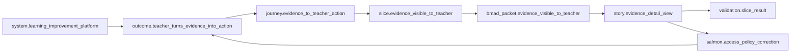
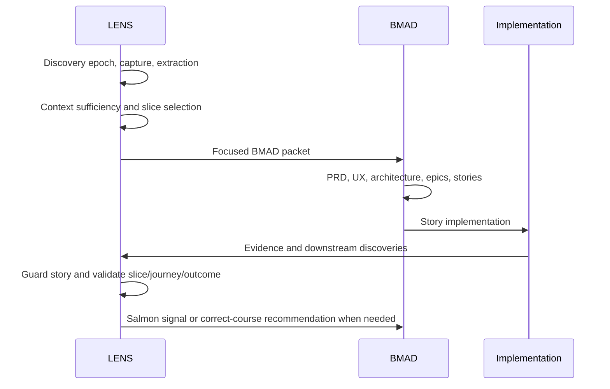

# LENS BMAD Module

LENS is a BMAD-native module for large-system exploration, navigation, slicing, and validation. It makes the slice the central operational unit, supports top-down discovery and bottom-up slice growth, and keeps Work Archive history separate from the current Living Landscape and rebuildable Derived Map projections.

LENS is not a standalone application, not a PRD generator, not a replacement for BMAD, and not a domain/service/feature-first organizer. It feeds BMAD with focused packets and validates whether built slices still match the intended slice, journey, and outcome.

## Official References

- BMAD Builder documentation: https://bmad-builder-docs.bmad-method.org/llms-full.txt
- BMAD Method documentation: https://docs.bmad-method.org/llms-full.txt

## Module Shape

This repository follows the BMAD Builder multi-skill module pattern:

- `skills/bmad-lens-setup/` registers module config and help entries.
- `skills/bmad-lens-*` contains workflow skills for discovery, slicing, mapping, BMAD bridge, validation, Salmon, Doctor, and Auspex.
- `.claude-plugin/marketplace.json` lists all installable skills.
- `_bmad-output/project-context.md` records traceability rules for agents working in this project.

## Source Truth

- Work Archive: `_bmad-output/lens/archive/` records what happened.
- Living Landscape: `_bmad-output/lens/landscape/` records current curated truth.
- Derived Map: `_bmad-output/lens/graph/` is generated and must not be hand-edited.
- Validation: `_bmad-output/lens/validation/` stores current validation outputs; `_bmad-output/lens/archive/validation-results/` preserves historical validation records.

Slices are reality. Landscape is interpretation. Graph is projection.

## Starting Points

Use `bmad-lens-help` when unsure.

Use `bmad-lens-discover` for a large ambiguous system idea. The top-down path is capture, extraction, context sufficiency, challenged assumptions, outcomes, journeys, slice selection, impact analysis, focused BMAD packet, BMAD execution, validation, and Salmon correction when implementation reveals reality.

Top-down discovery should finish with a concrete handoff: current gate, review order, candidate slice overview, selected first slice, adjacent or deferred slices, and action queue. Use `skills/bmad-lens-setup/assets/lens/templates/discovery-next-steps.md` for that output so users can see what to review and what happens next.

Use `bmad-lens-slice-new` for one useful bottom-up thing. A bottom-up slice can remain complete without a system, domain, service, capability, program, initiative, or roadmap.

The canonical slice artifact is `slice.yaml`: scope includes/excludes, acceptance evidence, and risks live inline in that file. `slice.md` can summarize the same record for humans, but separate acceptance-evidence or risks YAML files are not source truth.

Use `bmad-lens-context-check` as the required gate before BMAD handoff. It can block PRD or architecture work when discovery is still weak.

Use `bmad-lens-prepare-bmad` only after the active slice is focused enough to feed BMAD. It produces both `bmad-packet.md` for humans and `bmad-packet.yaml` for deterministic traceability. Use `bmad-lens-guard-story`, `bmad-lens-validate-slice`, `bmad-lens-salmon`, `bmad-lens-doctor`, and `bmad-lens-auspex` during implementation and review.

## No Growth Without Pressure

A slice never promotes automatically. Promotion requires repeated evidence such as artifact reuse, repeated workflow, repeated dependency, repeated risk, repeated ownership concern, repeated cross-slice coordination, repeated journey, or repeated implementation friction. Promotion candidates are explicit and human-reviewed.

## Installation

Run `bmad-lens-setup` from an environment where this module's skills are available. The setup skill writes module config to `_bmad/config.yaml`, user config to `_bmad/config.user.yaml`, and help entries to `_bmad/module-help.csv`.

Custom-module installation examples:

```bash
# Interactive custom-source install
npx bmad-method install

# Non-interactive local install from this repository
npx bmad-method install --custom-source /home/cweber/github/NextLens --tools claude-code --yes

# After skills are available in the target project
bmad-lens-setup --headless
```

## Usage Examples

Top-down discovery:

```text
bmad-lens-discover
Input: I want a school learning improvement platform where evidence helps teachers act.
Next: capture -> synthesize -> context-check -> map outcomes -> map journeys -> slice journey -> prepare BMAD.
```

Before BMAD planning, run `bmad-lens-analyze-impact`. Its impact map projects workstreams, conflicts, shared files, shared contracts, and related workstream gates into the Derived Map.

Bottom-up growth:

```text
bmad-lens-slice-new
Input: I want to download images from 3D printing model websites.
Result: create slice.download_model_images without creating a platform, domain, or capability.
```

Canonical fixture paths:

- `skills/bmad-lens-setup/assets/lens/fixtures/top-down/evidence-visible-to-teacher/`
- `skills/bmad-lens-setup/assets/lens/fixtures/bottom-up/download-model-images/`
- `skills/bmad-lens-setup/assets/lens/fixtures/bottom-up/top-down-discovery-next-step-map/`

Additional maintainer docs:

- `docs/lens-flows.md`
- `docs/top-down-discovery-handoff.md`
- `docs/glossary.md`

## Relationship Diagram



## Implementation Timeline



## Validation

Run the BMAD Builder module validator:

```bash
python3 .agents/skills/bmad-module-builder/scripts/validate-module.py skills
```

Run LENS asset validation:

```bash
python3 skills/bmad-lens-setup/assets/lens/scripts/validate_lens_assets.py --module-root .
```

Run direct script tests:

```bash
pytest skills/bmad-lens-setup/assets/lens/scripts/tests -q
pytest skills/bmad-lens-setup/scripts/tests -q
```

Run artifact smoke tests:

```bash
python3 skills/bmad-lens-setup/assets/lens/scripts/lens_artifact_ops.py init --project-root .
python3 skills/bmad-lens-setup/assets/lens/scripts/lens_artifact_ops.py map-rebuild --project-root .
python3 skills/bmad-lens-setup/assets/lens/scripts/lens_artifact_ops.py doctor --project-root .
python3 skills/bmad-lens-setup/assets/lens/scripts/lens_artifact_ops.py auspex --project-root .
```

Module-level BMAD eval-runner inputs live in `evals/lens/evals.json` and `evals/lens/triggers.json`.

`bmad-lens-doctor` performs deterministic checks for duplicate IDs, orphan references, missing source references, stale or needs-review records, missing ledger directories, unresolved promoted references, untraced stories, unsynced BMAD packet refs, relationship anomalies, unresolved decisions, and workstream impact gates.

The module is self-contained and does not require any original PDF or uploaded chat files. NorthStar-like education examples are fixtures only; this repository does not scaffold a NorthStarET application.
