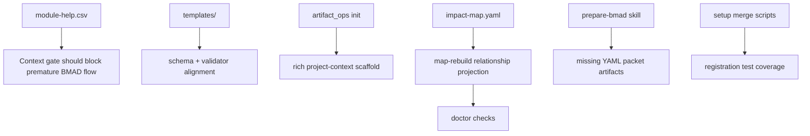

# NextLens repository gap analysis and Codex goal

## Executive summary

The `crisweber2600/NextLens` repository is already much farther along than a “missing scaffolding” diagnosis would suggest. Its README, plugin manifest, setup skill, module config, help registry, asset validator, artifact-ops script, eval runner files, and fixtures all show that the repo already has the BMAD Builder multi-skill module shape, plus the user-facing LENS surface for discovery, slicing, BMAD packet prep, story guard, validation, Salmon, Doctor, and Auspex. In other words, the big structural pieces are present; the remaining work is mostly about closing **consistency, enforcement, and test-coverage gaps** rather than inventing the module from scratch. fileciteturn10file0 fileciteturn12file0 fileciteturn13file0 fileciteturn14file0 fileciteturn15file0 fileciteturn19file0 fileciteturn20file0 fileciteturn22file0 fileciteturn23file0

The highest-value fixes are concentrated in six areas. First, `bmad-lens-context-check` is described as a gate, but its help-row is not registered as a blocking gate, and the LENS flow is not yet explicitly wired into parent BMAD capabilities through `before`/`after` integration. Second, the schema, templates, and fixtures drift from one another: some template/fixture kinds and statuses are not represented in the schema, and several templates omit the metadata that the module guide says major entities should carry. Third, `lens_artifact_ops.py init` scaffolds only a minimal `project-context.md`, even though the module’s own checked-in context file and BMAD Method guidance expect richer traceability and change-control rules. Fourth, the workstream-impact template advertises related-workstream analysis, but the graph rebuild logic does not project that structure into relationships or traceability. Fifth, the BMAD bridge skill says it writes both markdown and YAML packets, but only a markdown packet template exists. Sixth, Doctor’s documented audit scope is broader than the deterministic checks currently implemented, and setup-script behavior is under-tested compared with how central registration is in BMAD Builder conventions. fileciteturn15file0 fileciteturn17file0 fileciteturn19file0 fileciteturn20file0 fileciteturn24file0 fileciteturn25file0 citeturn3view4turn3view5turn3view0

## Sources and inspected repository surface

I grounded the analysis in two primary source classes. For conventions, I used the official BMAD Builder documentation and the official BMAD Method documentation. BMAD Builder is explicit that multi-skill modules should package a dedicated setup skill with merge scripts, `module.yaml`, `module-help.csv`, and a repository-root `.claude-plugin/marketplace.json`; it also defines how help rows, gates, and registration should work. BMAD Method is explicit about phase ordering, the role of architecture before epics/stories, custom-module installation, and the importance of `project-context.md` as project-wide implementation guidance. citeturn3view3turn3view4turn3view5turn3view1turn3view2turn1view0turn3view0

For repository evidence, I inspected the exact files below directly through the GitHub connector. The list is not a speculative reconstruction; these are the file paths I fetched and read during the scan. fileciteturn10file0 fileciteturn12file0

```text
README.md
.claude-plugin/marketplace.json

skills/bmad-lens-setup/SKILL.md
skills/bmad-lens-setup/assets/module.yaml
skills/bmad-lens-setup/assets/module-help.csv
skills/bmad-lens-setup/scripts/merge-config.py

skills/bmad-lens-help/SKILL.md
skills/bmad-lens-prepare-bmad/SKILL.md
skills/bmad-lens-doctor/SKILL.md
skills/bmad-lens-salmon/SKILL.md
skills/bmad-lens-auspex/SKILL.md

skills/bmad-lens-setup/assets/lens/references/lens-module-guide.md
skills/bmad-lens-setup/assets/lens/references/skill-contracts.md

skills/bmad-lens-setup/assets/lens/scripts/validate_lens_assets.py
skills/bmad-lens-setup/assets/lens/scripts/lens_artifact_ops.py
skills/bmad-lens-setup/assets/lens/scripts/tests/test_lens_artifact_ops.py
skills/bmad-lens-setup/assets/lens/scripts/tests/test_validate_lens_assets.py

skills/bmad-lens-setup/assets/lens/schemas/lens-entity.schema.json
skills/bmad-lens-setup/assets/lens/schemas/directory-map.yaml

skills/bmad-lens-setup/assets/lens/templates/slice.yaml
skills/bmad-lens-setup/assets/lens/templates/journey.yaml
skills/bmad-lens-setup/assets/lens/templates/discovery-epoch.yaml
skills/bmad-lens-setup/assets/lens/templates/relationship.yaml
skills/bmad-lens-setup/assets/lens/templates/promotion-gate.yaml
skills/bmad-lens-setup/assets/lens/templates/impact-map.yaml
skills/bmad-lens-setup/assets/lens/templates/bmad-packet.md
skills/bmad-lens-setup/assets/lens/templates/story-guard.yaml
skills/bmad-lens-setup/assets/lens/templates/validation-result.yaml
skills/bmad-lens-setup/assets/lens/templates/salmon-signal.yaml

skills/bmad-lens-setup/assets/lens/fixtures/top-down/evidence-visible-to-teacher/slice.yaml
skills/bmad-lens-setup/assets/lens/fixtures/top-down/evidence-visible-to-teacher/journey.yaml
skills/bmad-lens-setup/assets/lens/fixtures/bottom-up/download-model-images/slice.yaml
skills/bmad-lens-setup/assets/lens/fixtures/bottom-up/download-model-images/adjacency.yaml
skills/bmad-lens-setup/assets/lens/fixtures/bottom-up/download-model-images/promotion-gate.yaml

skills/bmad-lens-setup/assets/lens/evals/lens-evals.yaml
evals/lens/evals.json
evals/lens/triggers.json

_bmad-output/project-context.md
```

The manifest also declares the following skill directories as part of the module surface. This matters because BMAD Builder expects the manifest’s `skills` array to match actual skill directories, and the manifest is the canonical distribution surface for the module. fileciteturn12file0 citeturn2view2

```text
skills/bmad-lens-setup/
skills/bmad-lens-help/
skills/bmad-lens-intake/
skills/bmad-lens-slice-new/
skills/bmad-lens-slice-frame/
skills/bmad-lens-slice-scope/
skills/bmad-lens-detect-adjacency/
skills/bmad-lens-detect-repetition/
skills/bmad-lens-suggest-promotion/
skills/bmad-lens-discover/
skills/bmad-lens-capture/
skills/bmad-lens-synthesize/
skills/bmad-lens-context-check/
skills/bmad-lens-research-plan/
skills/bmad-lens-map-system/
skills/bmad-lens-map-outcomes/
skills/bmad-lens-map-loops/
skills/bmad-lens-map-journeys/
skills/bmad-lens-slice-journey/
skills/bmad-lens-map-capabilities/
skills/bmad-lens-analyze-impact/
skills/bmad-lens-promote-landscape/
skills/bmad-lens-map-rebuild/
skills/bmad-lens-prepare-bmad/
skills/bmad-lens-sync-bmad/
skills/bmad-lens-guard-story/
skills/bmad-lens-validate-slice/
skills/bmad-lens-validate-journey/
skills/bmad-lens-validate-outcome/
skills/bmad-lens-salmon/
skills/bmad-lens-doctor/
skills/bmad-lens-auspex/
```

## What the repository already gets right

The repository already matches the core BMAD Builder packaging pattern for a multi-skill module. It has a dedicated setup skill, module assets, merge scripts, and a repository-root plugin manifest. That is the precise shape BMAD Builder describes for multi-skill modules, and NextLens already follows it rather than requiring a fresh scaffold. fileciteturn12file0 fileciteturn13file0 fileciteturn14file0 fileciteturn50file0 citeturn3view3turn2view0

The user-facing LENS capability surface is also already broad and appropriately named. The manifest and help CSV both include the core skill families the user was concerned might be absent: discovery, capture, synthesis, context check, journey mapping, BMAD bridge preparation, story guard, slice/journey/outcome validation, Salmon, Doctor, and Auspex. That means the repo has already crossed the threshold from “concept” to “installable BMAD module.” fileciteturn12file0 fileciteturn15file0

The repo also has meaningful deterministic support code. `validate_lens_assets.py` checks for required skills, help rows, marketplace entries, schemas, templates, fixtures, evals, triggers, and the checked-in project context. `lens_artifact_ops.py` already implements `init`, `map-rebuild`, `doctor`, and `auspex`, and the existing tests exercise graph rebuild, warnings, traceability, and status generation. This is a strong base to improve rather than replace. fileciteturn19file0 fileciteturn20file0 fileciteturn21file0 fileciteturn51file0

The module is also already self-contained in the way the user requested earlier. The README explicitly says the repo does not require the original PDF or uploaded chat files, and the fixtures and evals are already embedded under module-owned paths. That is important because it means the final /goal can focus on repo fixes, not on reintroducing chat-attachment dependencies. fileciteturn10file0 fileciteturn36file0

## Gaps that still need to be closed



### Gating semantics are documented, but not enforced

BMAD Builder’s help system treats `required=true` rows as blocking gates and uses `before`/`after` relationships to construct the next-step dependency graph. It also explicitly supports expansion modules referencing parent-module capabilities so the extension can slot into the parent workflow. NextLens’s `module-help.csv` currently marks `bmad-lens-context-check` as `required=false`, even though the LENS module guide and skill contracts say context sufficiency must be able to block premature PRD creation. The help rows are also mostly wired only to other LENS rows, not to parent BMAD capabilities such as PRD, architecture, implementation-readiness, or correct-course. That means the repo’s **documentation says “gate”**, but the help registry does not yet make it a real gate. citeturn3view4turn3view5 fileciteturn15file0 fileciteturn17file0 fileciteturn18file0

The practical fix is to update `skills/bmad-lens-setup/assets/module-help.csv` so `bmad-lens-context-check` is a blocking gate, and to add parent BMAD `before`/`after` edges only where the official identifiers can be confirmed from BMAD docs or installed help rows. This is a **critical, small** change because it improves guidance without changing the skill surface. fileciteturn15file0 citeturn3view4turn3view5turn3view1

### The schema, templates, and fixtures drift from one another

The repository’s own design language expects durable metadata on major entities, including `id`, `kind`, `name`, `status`, `confidence`, timestamps, source refs, relationships, and open questions. But the current assets do not fully agree with one another. The schema’s `kind` enum does not include `impact_map`, even though the impact-map template uses `kind: impact_map`. The schema also does not include `promotion_gate`, even though the fixture root object is a `promotion_gate` with top-level metadata. The `status` enum excludes values like `active`, even though `slice.download_model_images` and the discovery-epoch template use `active`. In addition, templates such as `relationship.yaml`, `promotion-gate.yaml`, and `story-guard.yaml` omit much of the metadata that the module guide says should exist on major entities. fileciteturn17file0 fileciteturn33file0 fileciteturn41file0 fileciteturn32file0 fileciteturn30file0 fileciteturn46file0 fileciteturn48file0 fileciteturn42file0 fileciteturn43file0

This is more than a cosmetic mismatch. It weakens both deterministic validation and Codex implementation quality because the “canonical” template surface does not actually align with the repo’s own examples. The right fix is to normalize the schema and templates around the real artifact families the repo already uses, and to strengthen `validate_lens_assets.py` so it validates template/fixture compatibility instead of only checking file presence. This is a **critical, medium** fix. fileciteturn19file0 fileciteturn33file0

### Fresh-project bootstrap does not generate the project context the repo expects

The checked-in `_bmad-output/project-context.md` includes explicit Traceability, Scope, Architecture, Change, and Source Truth rules. BMAD Method also treats `project-context.md` as a project-wide implementation guide used by multiple workflows, including architecture, story creation, coding, review, sprint planning, and correct-course. Yet `lens_artifact_ops.py init` currently writes only a minimal starter file with a title and one sentence if the file is missing. The current repo tests validate the repo’s checked-in context file, but they do not verify that `init` generates the richer rule set for a newly initialized project. fileciteturn35file0 fileciteturn20file0 fileciteturn51file0 citeturn1view0turn3view0

This is a **critical, small** fix. The cleanest approach is to add a canonical project-context template under `skills/bmad-lens-setup/assets/lens/templates/` or `references/`, have `init` copy that template when the file is absent, and add a test asserting the generated file contains the required rule headings. fileciteturn20file0 fileciteturn35file0

### Workstream impact is modeled as a template, but not projected into the graph

The impact-map template is strong on paper. It includes `directly_impacted`, `possibly_conflicting`, `shared_files`, `shared_contracts`, rollout controls, policy boundaries, and a `related_workstream_gate`. That is a direct expression of the user’s reimagined-LENS emphasis on related workstream detection and AI-safe impact routing. But `lens_artifact_ops.py` does not currently consume `directly_impacted`, `possibly_conflicting`, or the workstream-gate fields when building relationships or traceability. Its relationship collection logic handles only a smaller, hard-coded set of fields, including a singular `workstream` key. So the repo **declares** related-workstream analysis, but the graph layer does not yet **project** it. fileciteturn41file0 fileciteturn20file0

This is a **high, medium** fix. It should be implemented by extending `collect_relationships()` and the traceability model so impact-map artifacts can emit relationships from the active slice to workstreams, services, domains, or capabilities, plus warnings when referenced impact targets are missing. A matching top-down fixture and test should prove the behavior. fileciteturn20file0 fileciteturn41file0

### The BMAD bridge promises dual packet formats, but only one is templated

`bmad-lens-prepare-bmad` says it should “write markdown and yaml packet forms.” The README also frames the BMAD bridge as a first-class LENS output area. But the current template surface includes only `templates/bmad-packet.md`, and the asset validator only requires that markdown template. There is no `bmad-packet.yaml` companion template or bridge fixture in the inspected surface. fileciteturn24file0 fileciteturn10file0 fileciteturn37file0 fileciteturn19file0

This is a **high, medium** fix because the bridge is central to how LENS hands focused context to BMAD. The repo should add `skills/bmad-lens-setup/assets/lens/templates/bmad-packet.yaml`, add at least one fixture packet in both Markdown and YAML form, teach the validator to require both, and add eval coverage for the YAML bridge output. fileciteturn24file0 fileciteturn37file0

### Doctor’s implemented checks do not yet match its documented scope

The Doctor skill says it audits orphaned entities, duplicate IDs, missing sources, stale ledgers, contradictions, trace gaps, parent-child mismatches, unresolved decisions, and unsynced BMAD artifacts. The module guide makes similarly broad claims. But the deterministic checks currently implemented in `lens_artifact_ops.py doctor` focus mainly on duplicate IDs, orphan refs, unresolved promoted refs, missing ledger directories, stale freshness signals, and untraced stories. That is useful, but it is narrower than the documented contract. fileciteturn25file0 fileciteturn17file0 fileciteturn20file0

This is a **high, medium** fix. The short path is not to make Doctor magical, but to make it honest and stronger: add deterministic checks for empty/missing `source_refs`, missing required metadata on key ledgers, contradictory or symmetric relationship anomalies where detectable, unresolved high-severity decisions, and unsynced BMAD packet/story references where the repo already models them. Then update Doctor docs to match exactly what the script enforces. fileciteturn20file0 fileciteturn25file0

### Registration behavior is central, but under-tested in the inspected surface

Registration is one of the core Builder conventions: configuration merges, anti-zombie replacement, and cleanup of installer package directories are part of the standard multi-skill-module lifecycle. NextLens has the correct merge script shape, and its setup skill explicitly relies on those operations. But the directly inspected test surface covers only `validate_lens_assets.py` and `lens_artifact_ops.py`; the setup behavior itself is not similarly represented in the inspected tests and documented command set. That makes regressions in config/help registration more likely than they need to be. fileciteturn13file0 fileciteturn50file0 fileciteturn21file0 fileciteturn51file0 citeturn3view4

This is a **medium, medium** fix. I would add setup-script tests under `skills/bmad-lens-setup/scripts/tests/` for `merge-config.py`, `merge-help-csv.py`, and `cleanup-legacy.py`, with at least one anti-zombie and one legacy-migration case each. fileciteturn50file0

## Prioritized remediation plan

The table below compares the current repo state with the required LENS module behavior and proposes the minimum file-path-level changes that will close the biggest gaps.

| Priority | Area | Current repo state | Exact file-path recommendation | Effort |
|---|---|---|---|---|
| Critical | Context gate enforcement | `bmad-lens-context-check` exists, but help-row gating is not blocking and parent BMAD ordering is not explicit. fileciteturn15file0 citeturn3view4turn3view5 | Modify `skills/bmad-lens-setup/assets/module-help.csv` to make context sufficiency an actual gate and wire bridge/correct-course rows into BMAD parent capabilities using only verified identifiers. | Small |
| Critical | Schema/template alignment | Schema kind/status enums and several templates/fixtures disagree. fileciteturn33file0 fileciteturn30file0 fileciteturn41file0 fileciteturn48file0 | Modify `skills/bmad-lens-setup/assets/lens/schemas/lens-entity.schema.json`; normalize `templates/relationship.yaml`, `templates/promotion-gate.yaml`, `templates/story-guard.yaml`, `templates/impact-map.yaml`; strengthen `skills/bmad-lens-setup/assets/lens/scripts/validate_lens_assets.py`. | Medium |
| Critical | `project-context.md` bootstrap | `init` writes a minimal context file, but the repo expects a richer one. fileciteturn20file0 fileciteturn35file0 | Add `skills/bmad-lens-setup/assets/lens/templates/project-context.md`; modify `skills/bmad-lens-setup/assets/lens/scripts/lens_artifact_ops.py`; extend `skills/bmad-lens-setup/assets/lens/scripts/tests/test_lens_artifact_ops.py`. | Small |
| High | Workstream impact graphing | Impact-map template exposes related-workstream structure that `map-rebuild` does not project. fileciteturn41file0 fileciteturn20file0 | Modify `skills/bmad-lens-setup/assets/lens/scripts/lens_artifact_ops.py`; add fixture `skills/bmad-lens-setup/assets/lens/fixtures/top-down/evidence-visible-to-teacher/impact-map.yaml`; extend graph/doctor tests. | Medium |
| High | BMAD packet dual format | Skill contract says markdown + YAML, but only markdown template is present. fileciteturn24file0 fileciteturn37file0 | Add `skills/bmad-lens-setup/assets/lens/templates/bmad-packet.yaml`; add top-down fixture packet files; update validator and evals. | Medium |
| High | Doctor fidelity | Doctor docs promise broader audits than the script currently enforces. fileciteturn25file0 fileciteturn20file0 | Extend `skills/bmad-lens-setup/assets/lens/scripts/lens_artifact_ops.py`; update `skills/bmad-lens-setup/assets/lens/references/lens-module-guide.md`; add tests and one invalid-topology fixture. | Medium |
| Medium | Setup-script coverage | Registration/cleanup are central but under-represented in inspected tests. fileciteturn13file0 fileciteturn50file0 | Add `skills/bmad-lens-setup/scripts/tests/test_merge_config.py`, `test_merge_help_csv.py`, and `test_cleanup_legacy.py`; optionally add a `pytest.ini` or keep local test invocation explicit. | Medium |
| Low | Auspex breadth | Auspex outputs read-only status artifacts, but no optional `dashboard.html` path is implemented in the inspected script. fileciteturn27file0 fileciteturn20file0 | Only add if desired: extend `lens_artifact_ops.py auspex` and docs/tests. This is optional, not required for compliance. | Medium |

## Validation commands and expected results

The repository already documents the core validation commands, and the current scripts make their success/failure shapes reasonably predictable. The BMAD Builder docs also make clear that module validation is part of the standard packaging flow. fileciteturn10file0 citeturn2view1turn3view3

| Command | Expected result after fixes | Expected failure mode before or during fixes |
|---|---|---|
| `python3 .agents/skills/bmad-module-builder/scripts/validate-module.py skills` | Clean structural validation for the BMAD module shape. This depends on a BMAD-enabled environment that actually provides the validator path. citeturn3view3turn2view1 | File-not-found or missing dependency if the local project does not have BMAD Builder installed at `.agents/skills/...`. |
| `python3 skills/bmad-lens-setup/assets/lens/scripts/validate_lens_assets.py --module-root .` | JSON exactly shaped like `{"status": "pass", "findings": []}` once the repo is internally consistent. The existing test asserts that exact success payload. fileciteturn19file0 fileciteturn51file0 | Non-zero exit with findings such as missing help entries, missing templates, schema/entity mismatches, absent project-context rules, or missing eval files. fileciteturn19file0 |
| `pytest skills/bmad-lens-setup/assets/lens/scripts/tests -q` | Existing graph/doctor/auspex tests pass, plus any new coverage added for project-context scaffolding, impact-map projection, or doctor checks. fileciteturn21file0 fileciteturn51file0 | Assertion failures on relationship/traceability counts, warning types, missing generated files, or validator output mismatches. |
| `python3 skills/bmad-lens-setup/assets/lens/scripts/lens_artifact_ops.py init --project-root .` | JSON with `status: "ok"`, a resolved `lens_root`, and a directory count; after the fix, it should also scaffold a full `project-context.md` rule set when absent. fileciteturn20file0 | Succeeds but produces only a minimal context file until fixed; after fix, failures would usually be file-permission or path errors. |
| `python3 skills/bmad-lens-setup/assets/lens/scripts/lens_artifact_ops.py map-rebuild --project-root .` | JSON with non-zero `nodes`, `relationships`, `traceability`, and structured warnings; after the impact-map fix, related workstream relationships should also appear. fileciteturn20file0 fileciteturn21file0 | Missing/empty relationships or traceability, or incomplete warning coverage where fixtures/templates are inconsistent. |
| `python3 skills/bmad-lens-setup/assets/lens/scripts/lens_artifact_ops.py doctor --project-root .` | JSON with `status: "ok"`, warning count, and a `by_type` summary; `doctor-report.md` and `warnings.yaml` should be written under `_bmad-output/lens/graph/`. fileciteturn20file0 | Missing warning classes or report-file generation if doctor logic regresses. |
| `python3 skills/bmad-lens-setup/assets/lens/scripts/lens_artifact_ops.py auspex --project-root .` | JSON with `status: "ok"`, output path, and active-slice count; `status.json`, `status.yaml`, and `stakeholder-summary.md` should exist under `_bmad-output/lens/auspex/`. fileciteturn20file0 | Missing output files or incomplete status sections if graph rebuild does not provide enough data. |
| `pytest skills/bmad-lens-setup/scripts/tests -q` | This should pass **after** adding setup-script coverage for config/help merge and cleanup behavior. | Before the fix, this path may be absent or incomplete. |

## Final Codex goal

The goal below is tailored to the repo’s current state. It assumes the repository already has the correct multi-skill module skeleton and asks Codex to **repair gaps**, not to invent a new application or a new NorthStarET codebase. It is self-contained and does not assume the original PDF is available.

```text
/goal

Work only in the repository crisweber2600/NextLens.

This repo is a BMAD Builder multi-skill module that implements the reimagined LENS framework. Do not create NorthStarET, do not scaffold an application, and do not assume any PDF, chat attachment, or external design file will be available. Treat this goal as the complete source of truth, supplemented only by the official BMAD docs below.

Authoritative conventions:
- BMAD Builder docs: https://bmad-builder-docs.bmad-method.org/llms-full.txt
- BMAD Method docs: https://docs.bmad-method.org/llms-full.txt

Core LENS model to preserve:
- LENS = Large-system Exploration, Navigation, Slicing, and validation framework.
- The central operating unit is the slice.
- Support two operating modes:
  - top-down discovery for large ambiguous system ideas
  - bottom-up slice growth for one useful thing without forcing platform/domain/capability creation
- LENS owns discovery, topology, traceability, validation, correction, and read-only visibility.
- BMAD owns PRD, UX, architecture, epics/stories, implementation, code review, and correct-course.
- Preserve source-truth separation:
  - archive = history / captured evidence / implementation history
  - landscape = current curated truth
  - graph = generated projection, rebuildable, never hand-edited
- No promotion without repeated pressure and human review.
- Related workstream impact must be explicit.
- Focused BMAD packet generation is required.
- Story guard, slice/journey/outcome validation, Salmon, Doctor, and Auspex are first-class module behavior.
- Keep the repo self-contained. Do not reintroduce any dependency on the original PDF.

Important constraints:
- Preserve the current multi-skill BMAD module shape.
- Preserve module code `lens`.
- Preserve existing user-facing skill directory names unless there is a compelling compatibility reason not to.
- Do not add a new application, service, or product scaffold.
- Do not inject NorthStarET-specific logic beyond generic fixture/example content already in the module.
- Prefer modifying and strengthening existing assets over creating parallel duplicates.
- Follow BMAD Builder packaging, registration, validation, and manifest conventions exactly.
- Follow BMAD Method phase ordering and project-context expectations exactly.

Repo-specific fixes to implement

A. Make the LENS gate behavior real in the help system
1. Update `skills/bmad-lens-setup/assets/module-help.csv`.
2. Make `bmad-lens-context-check` a real blocking gate for premature BMAD planning by using the BMAD Builder help-row semantics correctly.
3. Keep existing LENS sequencing, but also wire the relevant LENS bridge/correction steps into the parent BMAD workflow sequence through verified `before` / `after` references where official BMAD identifiers can be confirmed.
4. Do not guess parent BMAD identifiers. Resolve them from the official docs or from installed help rows if available in the environment.
5. Preserve existing menu codes unless a collision or clear correctness issue forces a change.

B. Reconcile schema, templates, fixtures, and validator rules
1. Normalize `skills/bmad-lens-setup/assets/lens/schemas/lens-entity.schema.json` so it covers the actual major artifact kinds and statuses used by the repo.
2. Ensure the schema and templates agree on kinds and metadata for:
   - discovery_epoch
   - slice
   - journey
   - relationship
   - impact_map
   - promotion_gate
   - validation_result
   - salmon_signal
   - BMAD packet artifacts
3. Reconcile status values so repo fixtures/templates are valid under the schema. If needed, separate base entity states from planning/working states in a clean, explicit way.
4. Add or fix required metadata in templates where it is missing, especially for:
   - `skills/bmad-lens-setup/assets/lens/templates/relationship.yaml`
   - `skills/bmad-lens-setup/assets/lens/templates/promotion-gate.yaml`
   - `skills/bmad-lens-setup/assets/lens/templates/story-guard.yaml`
   - `skills/bmad-lens-setup/assets/lens/templates/impact-map.yaml`
5. Strengthen `skills/bmad-lens-setup/assets/lens/scripts/validate_lens_assets.py` so it verifies semantic consistency, not just file presence. It should catch schema/template/fixture drift cleanly with actionable findings.
6. Prefer deriving skill inventory from the manifest and/or actual skills directory instead of relying only on a static hardcoded list where that improves long-term maintainability.

C. Fix fresh-project bootstrap so it creates the correct project context
1. Add a canonical LENS project-context template at one of these paths:
   - `skills/bmad-lens-setup/assets/lens/templates/project-context.md`
   - or a clearly named equivalent under `references/`
2. Update `skills/bmad-lens-setup/assets/lens/scripts/lens_artifact_ops.py` so `init` writes that rich template when `_bmad-output/project-context.md` is absent.
3. The generated context file must include explicit rules for:
   - traceability
   - scope discipline
   - architecture update discipline
   - upstream change / Salmon behavior
   - archive / landscape / graph source-truth boundaries
4. Do not overwrite an existing project-context file unless the existing behavior already prompts or defers correctly.

D. Make related workstream impact visible in the generated graph
1. Extend `skills/bmad-lens-setup/assets/lens/scripts/lens_artifact_ops.py` so `map-rebuild` projects `impact_map` artifacts into graph relationships and traceability.
2. Specifically support fields such as:
   - `active_slice`
   - `directly_impacted`
   - `possibly_conflicting`
   - `shared_files`
   - `shared_contracts`
   - `related_workstream_gate`
3. Create graph relationships and/or warnings that make related workstream detection visible to Doctor and Auspex.
4. Handle missing referenced impact targets cleanly by warning, not crashing.

E. Complete the BMAD bridge packet surface
1. Add `skills/bmad-lens-setup/assets/lens/templates/bmad-packet.yaml`.
2. Keep `skills/bmad-lens-setup/assets/lens/templates/bmad-packet.md`.
3. Ensure the markdown and YAML packet forms describe the same focused active-slice context:
   - active slice
   - optional top-down context
   - included scope
   - explicit exclusions
   - required capabilities
   - required decisions
   - risks
   - acceptance evidence
   - recommended BMAD next step
4. Update validator coverage so both packet forms are required.
5. Add at least one canonical top-down fixture packet in both formats.

F. Broaden Doctor so its implementation matches its documented contract
1. Extend Doctor’s deterministic auditing in `skills/bmad-lens-setup/assets/lens/scripts/lens_artifact_ops.py`.
2. Add checks for at least:
   - missing or empty `source_refs` on key entities
   - duplicate IDs
   - orphan references
   - stale / needs_review freshness signals
   - missing ledger directories
   - untraced stories
   - unresolved promoted refs
   - obvious relationship anomalies where deterministically detectable
   - unresolved high-severity decision or BMAD-sync gaps where the repo already models those references
3. Keep Doctor deterministic-first. Do not invent vague LLM-only heuristics in the script.
4. Update docs so Doctor’s documented scope matches the implemented behavior exactly.

G. Expand fixtures so the module proves the full reimagined LENS flow
1. Add or enrich fixture files under:
   - `skills/bmad-lens-setup/assets/lens/fixtures/top-down/evidence-visible-to-teacher/`
   - `skills/bmad-lens-setup/assets/lens/fixtures/bottom-up/download-model-images/`
2. The top-down fixture set should include, at minimum:
   - discovery epoch example
   - impact map example
   - BMAD packet in markdown and YAML
   - story guard example
   - validation result example
   - salmon signal example
3. Keep the bottom-up fixture a true slice-first example that does not force system/domain/capability creation by default.
4. Ensure fixtures exercise:
   - repeated-pressure promotion
   - workstream impact
   - traceability
   - Doctor warnings
   - Auspex output
5. Do not add filler fixtures. Every fixture must prove some behavior used by scripts, evaluator inputs, or docs.

H. Add missing tests around registration and strengthened artifact behavior
1. Keep and extend:
   - `skills/bmad-lens-setup/assets/lens/scripts/tests/test_lens_artifact_ops.py`
   - `skills/bmad-lens-setup/assets/lens/scripts/tests/test_validate_lens_assets.py`
2. Add setup-script tests under:
   - `skills/bmad-lens-setup/scripts/tests/test_merge_config.py`
   - `skills/bmad-lens-setup/scripts/tests/test_merge_help_csv.py`
   - `skills/bmad-lens-setup/scripts/tests/test_cleanup_legacy.py`
3. Cover at least:
   - anti-zombie replacement behavior
   - legacy config fallback/default migration
   - module-help merge behavior
   - safe cleanup/idempotency
   - `init` creating the richer project-context scaffold
   - graph rebuild consuming impact-map relationships
   - BMAD packet YAML presence and validity
   - Doctor detecting at least one newly added deterministic audit category

I. Update eval inputs and documentation so the repo explains and proves the improved behavior
1. Update:
   - `skills/bmad-lens-setup/assets/lens/evals/lens-evals.yaml`
   - `evals/lens/evals.json`
   - `evals/lens/triggers.json`
2. Add or refine eval coverage for:
   - context sufficiency as a real gate
   - focused BMAD packet in both formats
   - related workstream impact detection
   - project-context initialization
   - Doctor warnings on richer invalid-topology cases
3. Update docs as needed so the repo stays self-describing:
   - `README.md`
   - `skills/bmad-lens-setup/assets/lens/references/lens-module-guide.md`
   - `skills/bmad-lens-setup/assets/lens/references/skill-contracts.md`

Definition of done
- The repository remains a BMAD Builder multi-skill module with the current LENS skill surface.
- No new app scaffold or NorthStarET implementation is created.
- `validate_lens_assets.py` passes cleanly.
- The repo still validates as a BMAD module under the BMAD Builder validator.
- `lens_artifact_ops.py init` scaffolds a rich `project-context.md` when needed.
- `map-rebuild` projects impact-map/workstream relationships into graph outputs.
- Doctor checks are broader and tested.
- Both BMAD packet formats exist and are validated.
- Fixtures and evals cover the strengthened behavior.
- README and reference docs accurately describe what the repo now does.
- No placeholders, ellipses, or pseudo-templates remain in tracked assets.

Validation commands to run before finishing
- `python3 .agents/skills/bmad-module-builder/scripts/validate-module.py skills`
- `python3 skills/bmad-lens-setup/assets/lens/scripts/validate_lens_assets.py --module-root .`
- `pytest skills/bmad-lens-setup/assets/lens/scripts/tests -q`
- `pytest skills/bmad-lens-setup/scripts/tests -q`
- `python3 skills/bmad-lens-setup/assets/lens/scripts/lens_artifact_ops.py init --project-root .`
- `python3 skills/bmad-lens-setup/assets/lens/scripts/lens_artifact_ops.py map-rebuild --project-root .`
- `python3 skills/bmad-lens-setup/assets/lens/scripts/lens_artifact_ops.py doctor --project-root .`
- `python3 skills/bmad-lens-setup/assets/lens/scripts/lens_artifact_ops.py auspex --project-root .`

Output expectations
- Produce the actual repo changes only.
- Keep changes narrowly scoped to the gaps above.
- If a convention is ambiguous, prefer the official BMAD Builder docs for packaging/registration and the official BMAD Method docs for phase and project-context behavior.
```

## Assumptions

This analysis assumes the repository branch to modify is the currently fetched `main` branch, because the inspected files were fetched from `main`. I treated the BMAD Builder validator path under `.agents/skills/...` as an environment-dependent external prerequisite rather than as a repo-owned file. I did not assume any CI system, GitHub Actions workflow, or release automation because none of those were part of the inspected file set. I also treated the original LENS PDF and earlier pasted design materials as **context for intent**, not as runtime dependencies, because the repo README already frames the module as self-contained.