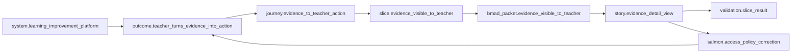
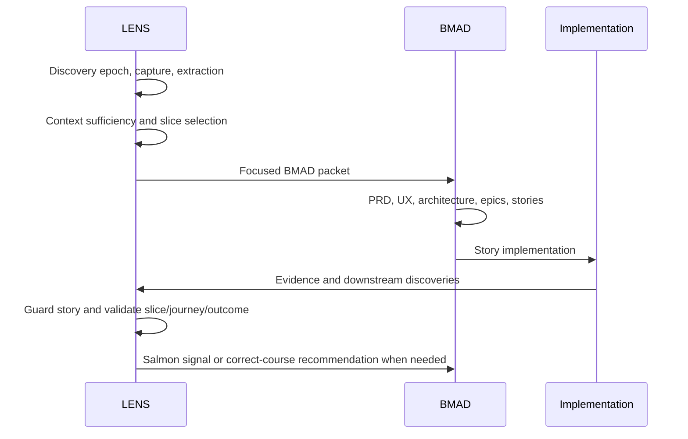

# LENS Module Guide

## Purpose

LENS means Large-system Exploration, Navigation, Slicing, and validation framework. It is a BMAD-native slice orchestration and evolving knowledge-topology module. BMAD makes work buildable. LENS makes the work understandable, traceable, adaptable, and coherent, then checks whether the built slice still matches reality.

LENS is not a standalone app, not a PRD generator, not a replacement for BMAD, and not a domain/service/feature-first organizer. NorthStar-like education material may appear only as small examples, fixtures, docs snippets, or eval scenarios.

Official references for maintainers:

- BMAD Builder documentation: https://bmad-builder-docs.bmad-method.org/llms-full.txt
- BMAD Method documentation: https://docs.bmad-method.org/llms-full.txt

Use BMAD Builder conventions for module packaging, skill structure, setup, manifests, `module-help.csv`, validation, packaging, marketplace/plugin shape, tests, evals, and triggers. Use BMAD Method conventions for lifecycle phases, artifact locations, project context behavior, implementation workflow behavior, and correct-course behavior.

## Installation And Validation

Custom module install examples:

```bash
npx bmad-method install
npx bmad-method install --custom-source /home/cweber/github/NextLens --tools claude-code --yes
bmad-lens-setup --headless
```

Validation commands:

```bash
python3 .agents/skills/bmad-module-builder/scripts/validate-module.py skills
python3 skills/bmad-lens-setup/assets/lens/scripts/validate_lens_assets.py --module-root .
pytest skills/bmad-lens-setup/assets/lens/scripts/tests -q
python3 skills/bmad-lens-setup/assets/lens/scripts/lens_artifact_ops.py init --project-root .
python3 skills/bmad-lens-setup/assets/lens/scripts/lens_artifact_ops.py map-rebuild --project-root .
python3 skills/bmad-lens-setup/assets/lens/scripts/lens_artifact_ops.py doctor --project-root .
python3 skills/bmad-lens-setup/assets/lens/scripts/lens_artifact_ops.py auspex --project-root .
```

Canonical fixtures:

- `skills/bmad-lens-setup/assets/lens/fixtures/top-down/evidence-visible-to-teacher/`
- `skills/bmad-lens-setup/assets/lens/fixtures/bottom-up/download-model-images/`

## Central Unit

The central unit of LENS is the slice. A slice is a small, useful, testable, end-to-end unit of work. It may be a tiny utility, workflow step, product journey segment, integration path, proof of concept, or feature-sized implementation. A slice can remain a slice forever.

A slice is allowed to exist without a system, domain, service, capability, program, initiative, or roadmap. Those higher-order structures are optional landscape metadata that may emerge later.

The canonical slice source-truth artifact is `slice.yaml`. It keeps `scope.includes`, `scope.excludes`, `acceptance_evidence`, and `risks` inline with the slice record. `slice.md` can be generated for human review, but separate `acceptance-evidence.yaml` or `risks.yaml` files are not canonical LENS slice records.

## No Growth Without Pressure

Do not promote a slice into a capability, domain, program, or system just because the model can imagine one. Promotion is optional, explicit, evidence-driven, and human-reviewed.

Pressure means repeated evidence such as repeated artifact reuse, repeated workflow, repeated dependency, repeated risk, repeated ownership concern, repeated cross-slice coordination, repeated user journey, or repeated implementation friction.

Promotion ladder:

```text
slice -> adjacency -> repeated pattern -> capability candidate -> capability -> capability cluster -> domain -> program -> system
```

## Two Modes

### Top-Down LENS

Use when a user has a large ambiguous system idea.

Required flow:

```text
large ambiguous vision -> discovery epoch -> raw capture -> extracted hypotheses -> challenged assumptions -> role and stakeholder map -> outcome map -> operating loops -> journeys -> selected vertical slice -> capability and impact analysis -> focused BMAD packet -> BMAD planning and implementation -> LENS validation -> landscape update -> Salmon correction when reality disagrees
```

Top-down LENS must not jump directly from brainstorm to PRD. It requires captured context, extracted hypotheses, context sufficiency, challenged assumptions, focused outcome, mapped journey, selected vertical slice, capability and impact map, and a focused BMAD packet before BMAD PRD, UX, architecture, or epics.

Every top-down discovery pass must also produce an explicit handoff before BMAD planning: current gate, review order, candidate slice overview, selected first slice, adjacent or deferred slices, and action queue. The canonical template is `templates/discovery-next-steps.md`. The handoff should call source-truth units slices, while human-facing explanations may describe them as thin work options when the user is still learning the term.

### Bottom-Up LENS

Use when the user only knows one useful thing.

Required flow:

```text
small useful slice -> local artifact -> optional adjacency -> repeated pressure -> optional capability candidate -> optional capability -> optional domain -> optional system -> BMAD execution only when needed
```

The first response to a bottom-up request is a slice, not a platform. Adjacent slices can be connected with weak adjacency. Promotion requires repeated pressure and human review.

## Knowledge States

- raw: captured directly from a user, session, whiteboard, document, codebase, BMAD artifact, or source.
- extracted: identified as a possible concept, role, outcome, journey, artifact, risk, relationship, or capability.
- hypothesized: structured by LENS but not yet confirmed.
- challenged: reviewed for contradictions, missing pieces, or weak assumptions.
- reviewed: human reviewed and accepted as plausible.
- approved: accepted as current working truth.
- validated: supported by implementation, stakeholder evidence, test evidence, or repeated evidence.
- superseded: replaced by a newer model.
- archived: kept for history but no longer active.

Confidence levels are low, medium, and high. AI hypotheses must not be treated as facts.

## Core Entities

LENS supports these entity kinds: system, system_thesis, discovery_epoch, session, source, extraction, slice, artifact, adjacency, relationship, role, stakeholder, outcome, operating_loop, journey, journey_step, capability, domain, service, workstream, program, decision, assumption, unknown, risk, evidence, impact_map, promotion_gate, story, implementation_evidence, salmon_signal, auspex_status, bmad_packet, and validation_result.

Minimum metadata for major entities:

```yaml
id: string
kind: string
name: string
status: raw|extracted|hypothesized|challenged|reviewed|approved|validated|superseded|archived
confidence: low|medium|high
created_at: string
updated_at: string
source_refs: []
relationships: []
open_questions: []
```

Planning artifacts also carry:

```yaml
status: draft|reviewed|approved|blocked|superseded|archived
validity: current|stale|needs_review
```

Planning artifact validity must not depend on git branch placement.

## Topology

### Work Archive

The Work Archive preserves what happened. It is append-only or mostly append-only.

Expected storage:

```text
_bmad-output/lens/archive/
  capture/sessions/
  capture/uploads/
  capture/sources.yaml
  extractions/extraction-index.yaml
  extractions/extraction-*.yaml
  slices/
  bmad-packets/
  implementation-evidence/
  validation-results/
  salmon-signals/
```

Validation history that must be retained for audit belongs under `archive/validation-results/`. Current validation working outputs belong under `_bmad-output/lens/validation/`.

### Living Landscape

The Living Landscape preserves current truth. It is curated, reorganizable, and human-readable.

Expected storage:

```text
_bmad-output/lens/landscape/
  systems/
  programs/
  domains/
  capabilities/
  services/
  journeys/
  workstreams/
  decisions/
  risks/
```

### Derived Map

The Derived Map is generated from archive and landscape metadata. It is not source truth, is rebuildable, and must not be hand-edited.

Expected storage:

```text
_bmad-output/lens/graph/
  derived-map.yaml
  derived-map.json
  relationship-index.yaml
  traceability-index.yaml
  freshness-index.yaml
  warnings.yaml
```

Core rule: archive records history, landscape records current truth, graph projects machine-readable relationships. Slices are reality. Landscape is interpretation. Graph is projection.

## Relationship Model

Relationships are first-class. They carry lifecycle, confidence, provenance, review state, promotion state, and validation state.

Lifecycle:

```text
raw -> extracted -> hypothesized -> challenged -> reviewed -> promoted -> planned -> implemented -> validated -> superseded -> archived
```

Required relationship types: expresses, serves, realized_by, decomposed_into, produces_artifact, consumes_artifact, adjacent_to, requires, participates_in, implemented_by, planned_by, decomposed_by, implemented_by_story, validated_by, impacted_by, possibly_conflicts_with, touches_file, touches_contract, promotes_to, related_to, and supersedes.

Relationship gates: discovery, challenge, promotion, BMAD, implementation, Salmon, and validation.

## BMAD Phase Mapping

BMAD Analysis: LENS handles intake, capture, extraction, discovery epochs, context sufficiency checks, research planning, system thesis formation, and role/outcome discovery.

BMAD Planning: LENS provides focused BMAD packets with system context if available, active outcome if available, active journey if available, active slice, exclusions, acceptance evidence, required capabilities, decisions, risks, and boundaries.

BMAD Solutioning: LENS provides journey context, vertical slice scope, impact map, workstream map, capability candidates, landscape ledgers, architecture input, epic/story input, and readiness input.

BMAD Implementation: LENS provides story traceability guards, slice scope guards, acceptance evidence guards, validation reports, Salmon upstream correction, landscape reconciliation, and Auspex visibility.

LENS feeds BMAD. LENS does not replace BMAD.

## Required Storage Layers

- Capture: `_bmad-output/lens/archive/capture/`
- Extraction: `_bmad-output/lens/archive/extractions/`
- Intent: `_bmad-output/lens/intent/`
- Journey: `_bmad-output/lens/journeys/`
- Slice: `_bmad-output/lens/slices/`
- Landscape: `_bmad-output/lens/landscape/`
- Graph: `_bmad-output/lens/graph/`
- BMAD bridge: `_bmad-output/lens/bmad-bridge/`
- Implementation guard: `_bmad-output/lens/implementation/`
- Validation: `_bmad-output/lens/validation/`
- Validation archive: `_bmad-output/lens/archive/validation-results/`
- Salmon: `_bmad-output/lens/salmon/`
- Auspex: `_bmad-output/lens/auspex/`

## Context Sufficiency

`bmad-lens-context-check` must be able to say: "We are not ready for PRD yet." It evaluates system thesis, role map, stakeholder map, outcome matrix, operating loops, journey readiness, slice readiness, capability readiness, architecture readiness, BMAD PRD readiness, open questions, unresolved decisions, high-severity risks, research gaps, and unchallenged assumptions.

The module help registration marks context-check as required before `bmad-lens-prepare-bmad`. When the gate fails, continue discovery, elicitation, review, or research instead of jumping to BMAD PRD generation.

## Focused BMAD Packets

A LENS BMAD packet includes only the active slice context needed by BMAD. It excludes adjacent future slices, unvalidated assumptions, speculative architecture, and unpromoted capability clusters.

`bmad-lens-prepare-bmad` emits two aligned forms: `bmad-packet.md` for BMAD/human review and `bmad-packet.yaml` for graph rebuild, traceability, validation, and repeatable checks.

## Impact Maps

`bmad-lens-analyze-impact` records directly impacted workstreams, possibly conflicting workstreams, shared files, shared contracts, produced and consumed artifacts, tests, observability, rollout controls, data/privacy/policy boundaries, architecture decisions, and the related workstream gate result.

`bmad-lens-map-rebuild` projects those fields into Derived Map relationships such as `impacted_by`, `possibly_conflicts_with`, `touches_file`, and `touches_contract`, and it adds traceability fields for impacted workstreams, shared files, and shared contracts.

## Implementation Guard

`bmad-lens-guard-story` checks that a story traces to an active LENS slice, does not silently expand scope, includes acceptance evidence, acknowledges risks, preserves privacy/security/policy boundaries, references the BMAD packet or active slice context, includes promoted capabilities when applicable, and recommends Salmon when upstream assumptions change.

## Salmon

Salmon is the upstream correction mechanism. Implementation reveals reality. Salmon detects downstream truth and decides whether it updates landscape truth, requires BMAD correct-course, invalidates a slice, changes a journey, affects architecture, or impacts another workstream.

Salmon flow:

```text
story -> slice -> journey -> outcome -> capability -> domain -> program -> system
```

Salmon does not replace BMAD correct-course. It detects and propagates upstream impact; BMAD correct-course handles formal replanning.

## Doctor

Doctor audits orphan references, missing source references, duplicate IDs, self-loop or missing-type relationship anomalies, missing ledgers, stale or needs-review records, unresolved promoted references, untraced stories, unsynced BMAD packets, unresolved decisions, workstream impact gates, derived map inconsistencies, relationship contradictions, and freshness metadata.

## Auspex

Auspex is read-only stakeholder visibility. It shows system status, active outcomes, journeys, slices, artifact freshness, decisions, risks, blockers, BMAD progress, validation evidence, Salmon signals, and source traceability. Auspex reads the Derived Map and must not become source truth.

## Usage Examples

Top-down example:

```text
User: I want a learning improvement platform where evidence helps teachers know what to do next.
LENS: bmad-lens-discover -> bmad-lens-capture -> bmad-lens-synthesize -> bmad-lens-context-check -> bmad-lens-map-outcomes -> bmad-lens-map-journeys -> bmad-lens-slice-journey -> bmad-lens-analyze-impact -> bmad-lens-prepare-bmad.
```

Bottom-up example:

```text
User: I want to download images from 3D printing model websites.
LENS: bmad-lens-slice-new creates slice.download_model_images, records artifact.model_image_set, and does not create a system, domain, service, or capability unless repeated pressure appears later.
```

## Mermaid Relationship Diagram



## Mermaid Implementation Timeline


